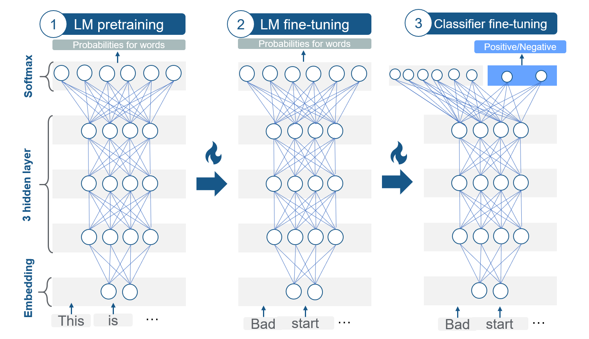

# NLP-Spam-Detection
Using NLP and LLM's, I trained a model that is capable of detecting spam replies to tweets. 

---
This is based on ULM-fit:

---
For an in depth summary, please read my blog post:

[LINK](https://medium.com/@justin.donnelly0804/using-nlp-to-detect-scam-tweets-with-fastai-ulmfit-1d5ad005808f)

